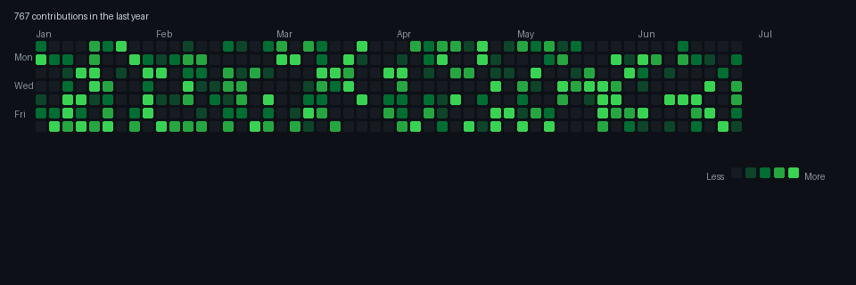

# 💫 About Me:
Currently building things that (hopefully) work on the first try 🔭  Always open to team up on projects that actually make a difference 🤝  Still figuring out why my code works... and sometimes why it doesn't 🆘  Leveling up every day, one project at a time 🌱  Ask me anything about web dev, I might even know the answer 💬

## 🌐 Socials:
  

# 💻 Tech Stack:
              
# 📊 GitHub Stats:
 
 

 

  

---

<!-- Proudly created with GPRM ( https://gprm.itsvg.in ) -->
